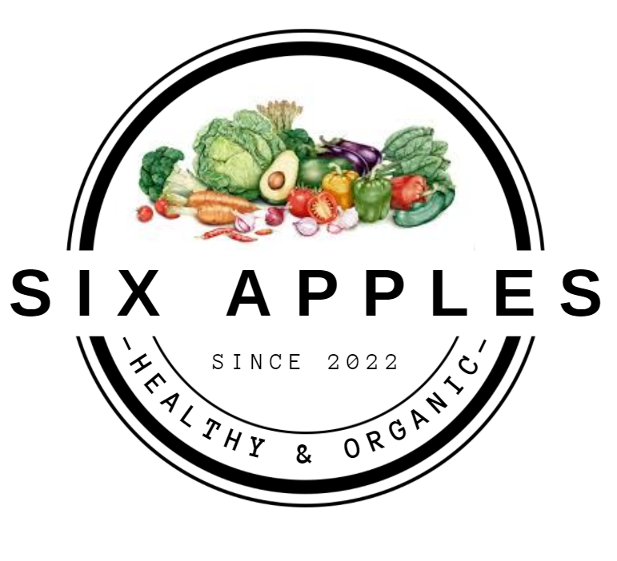

# **¡¡Bienvenidos al proyecto Six Apples!!**

## ¡Hola! Somos un equipo de desarrolladores web que aceptó el desafío de crear nuestro primer e-commerce!!
## Nuestro sitio, llamado Six Apples, busca dar salud, bienestar y comodidad a los clientes, al ofrecer frutas y verduras de la mejor calidad y evitar tener que salir de tu casa para comprarlas!! ¿No es eso genial? 
## A través de esta página web, cualquier persona puede acceder a nuestros productos con solo algunos clicks de forma sencilla y dinámica! Los invitamos a ingresar!
# El equipo:
- ## Andrea Chacón, desarrolladora en acción, llena de entusiasmo y ganas de dar lo mejor en su trabajo.
- ## Joaquín Galván, diseñador gráfico y desarrollador que busca superarse constantemente a sí mismo.
- ## Gary Rodriguez, un desarrollador web con ganas de aprender y encarar nuevos desafíos.
- ## Karen Calisaya, desarrolladora entusiasta, capaz de aprender cosas nuevas.