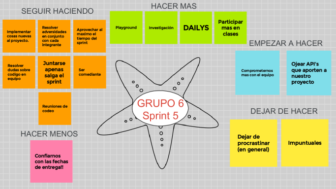
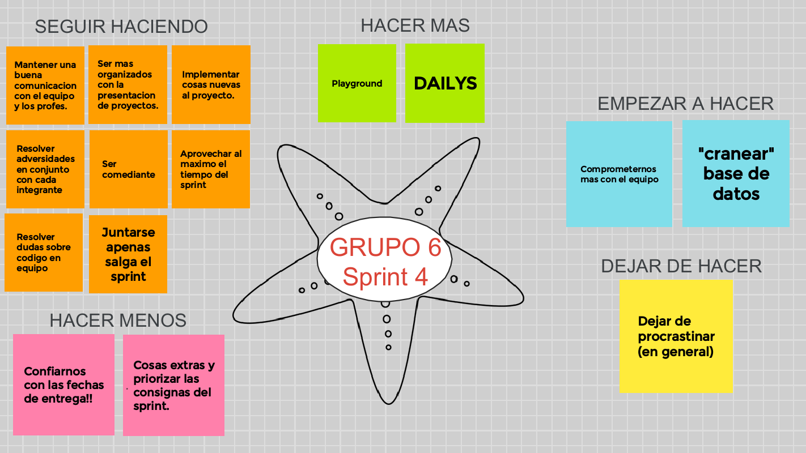
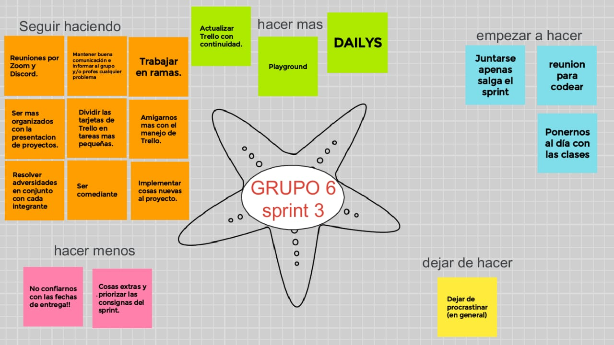
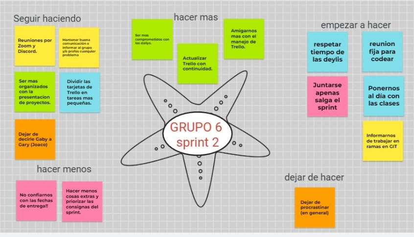

# Retrospectiva

# Sprint 6

### Al comenzar a realizar la retrospectiva, nos dimos cuánta de que ya estamos en nuestro 7.º sprint, y de la cantidad de cosas que pudimos mejorar gracias a realizar una retrospectiva antes de comenzar uno nuevo.
### Ya que estamos en el tramo final, decidimos ir cerrando y ultimando detalles de nuestro hermoso proyecto.
### En este sprint no tuvimos muchos problemas con lo que es codeo, tomamos bien base de datos y no nos generó grandes problemas, lo que por ahí nos costó un poco, fue la organización del equipo, pero con comunicación se resolvió.
### Cómo siempre dejamos algunas tarjetas para siempre tenerlas presentes y no olvidarnos.
### Por último, ya estamos en el 7.º sprint y seguimos trabajando para que cada vez nuestro proyecto este mejor.

# Sprint 5

### En este sprint 5 trabajamos en nuestra retrospectiva para seguir y recordar varios puntos en todos los sprint. 
### En este sprint tomamos en cuenta en las dayli la sugerencia de conectarnos y resolver dudas en conjunto pero tambien trabajando en las tareas que se nos asigno.
### Tambien trabajamos con los middlewares y tuvimos algunos incovenientes, ya que el middleware de admin buscaban el rol que le pasabamos como string, del JSON. Pero fue solucionado haciendo que consuma esos datos desde la db, de la tabla de rol, lo hicimos requerir al db y traer el resultado. 
### Tomando en cuenta como en los sprint anteriores cada integrante se desarrollo muy bien y pudo culminar, apesar de los incovenientes, las tareas asignadas.. De igual forma seguiremos enfocandonos en base de datos y en apis que es un tema que nos re servirá para nuestro proyecto y todo quedo fenomenal.

# Sprint 4

 

 ### Como siempre al realizar un nuevo sprint, hacemos una restrospectiva de las cosas a mejorar de los anteriores, seguimos utilizando el metodo de la estrella de mar, por el momento nos parece el mas efectivo a la hora de recordar ciertos puntos de sprints anteriores.
 ### Para este sprint tuvimos en cuenta muchas de las cosas marcadas en retrospectivas anteriores, y pudimos mejorar mucho, tanto individualmente como en equipo. Nos enfocamos en en las consignas principales del sprint y pudimos terminarlo en poco tiempo, aprendimos a no confiarnos tanto con las fechas de entrega, aunque igualmente, tenemos cosas para mejorar.
 ### Generalmente, nos queremos enfocar en base de datos, es un tema nuevo que se viene fuerte y no queremos que nos agarre de imprevisto. Tambien dejamos ciertas tarjetas que nos identifica como grupo, nos gusta tomarnos las cosas con gracia, ya que se hace mas ameno el codear y pasar tiempo como equipo.
 ### Otro dato, dejamos las tarjetas de "hacer menos" o "dejar de hacer", para siempre tenerlas presentes y no cometer esos errores.

# Sprint 3

 

### Estamos ya en nuestro cuarto Sprint y antes de encararlo con todo, decidimos (como en cada Sprint) darle una ojeada a los puntos a mejorar del Sprint anterior.
### Como equipo, charlamos y pusimos en común todo lo que pudimos haber mejorado en el Sprint anterior, de esta manera, mediante la dinámica de la estrella de mar, logramos darnos cuenta de las diferentes cosas a tener en cuenta.
### Así es como logramos, Sprint tras Sprint ir mejorando nuestro desempeño como equipo y programadores.
### Como vistazo general, nos confiamos mucho de las fechas de entrega, pero en conjunto nos organizamos perfectamente para terminar el Sprint a tiempo y de la mejor manera.
### Para finalizar, nos quiero felicitar a cada uno de los integrantes de este equipo por nuestro excelente desarrollo en este Sprint!!👨‍💻👩‍💻

# Sprint 2 

 

### Para una retrospectiva general tuvimos en cuenta los puntos a reforzar del sprint 1 para la realizacion de este, el cual fue super importante ya que nos unimos mas como equipo y aportamos todos muy buenas ideas y maneras para poder llevar a cabo los puntos a reforzar. 
### Al culminar nuestro segundo sprint, realizamos la dinámica de estrella de mar, que como en el sprint 1 nos ayudo a identifica nuestras fortalezas y debilidades, en el caso el sprint 2 nos propusimos varios puntos a realizar los cuales fueron de gran ayuda para la hora de realización de el trabajo.
### En general, todos los integrantes del equipo, trabajando en conjunto y también en parte individual, se pudo culminar con exito este sprint 2 tomando en cuenta que puntos mejoramos en este trabajo integrador.. 

# Sprint 1 

### Al terminar nuestro primer sprint, realizamos una retrospectiva general de lo que fueron nuestros primeros trabajos como equipo, tuvimos la suerte de que cada integrante del equipo aporto excelentes ideas y maneras para la realización del primer sprint.
### Para esta retrospectiva, realizamos la dinámica de estrella de mar, que nos ayudo muchísimo a identificar nuestras fortalezas y debilidades.
### En general, hicimos un excelente trabajo, tanto en equipo como individualmente, aunque, gracias a esta dinámica, nos dimos cuenta de ciertos puntos a mejorar por lo que queda de este trabajo integrador.