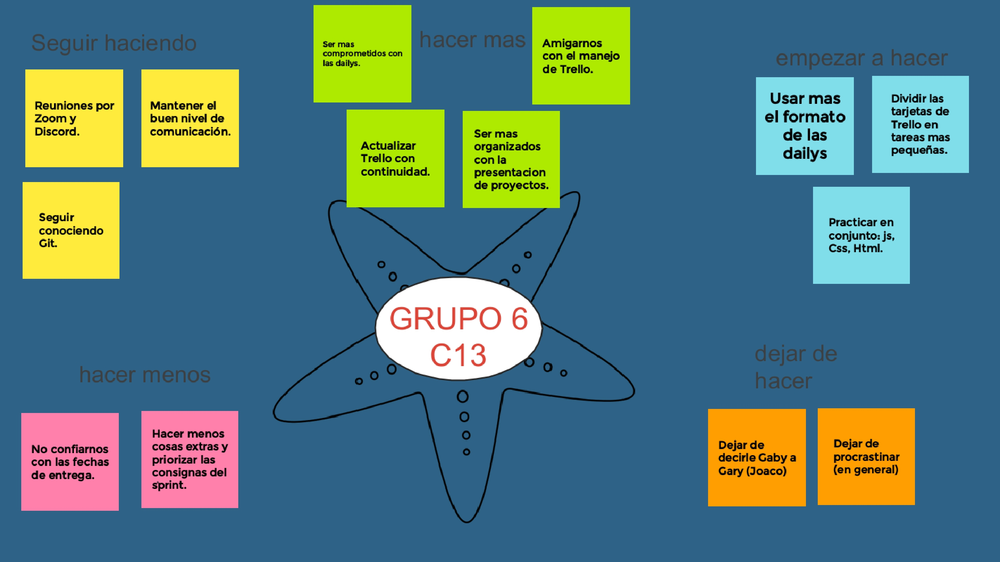

# Retrospectiva 

# Sprint 2 

 ![estrella] (./data-del-grupo/sprint2Grupo6.jpg)

### Para una retrospectiva general tuvimos en cuenta los puntos a reforzar del sprint 1 para la realizacion de esté, el cual fue super importante ya que nos unimos mas como equipo y aportamos todos muy buenas ideas y maneras para poder llevar a cabo los puntos a reforzar. 

### Al culminar nuestro segundo sprint, realizamos la dinámica de estrella de mar, que como en el sprint 1 nos ayudo a identifica nuestras fortalezas y debilidades, en el caso el sprint 2 nos propusimos varios puntos a realizar los cuales fueron de gran ayuda para la hora de realización de el trabajo.

### En general, todos los integrantes del equipo, trabajando en conjunto y también en parte individual, se pudo culminar con exito este sprint 2 tomando en cuenta que puntos mejoramos en este trabajo integrador.. 

# Sprint 1 

### Al terminar nuestro primer sprint, realizamos una retrospectiva general de lo que fueron nuestros primeros trabajos como equipo, tuvimos la suerte de que cada integrante del equipo aporto excelentes ideas y maneras para la realización del primer sprint.
### Para esta retrospectiva, realizamos la dinámica de estrella de mar, que nos ayudo muchísimo a identificar nuestras fortalezas y debilidades.
### En general, hicimos un excelente trabajo, tanto en equipo como individualmente, aunque, gracias a esta dinámica, nos dimos cuenta de ciertos puntos a mejorar por lo que queda de este trabajo integrador.